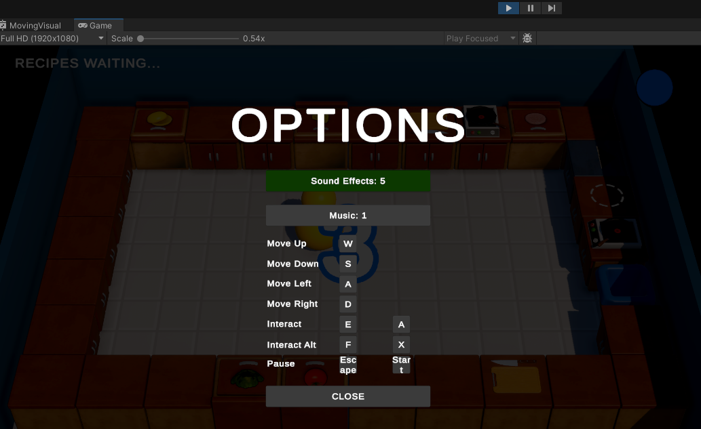
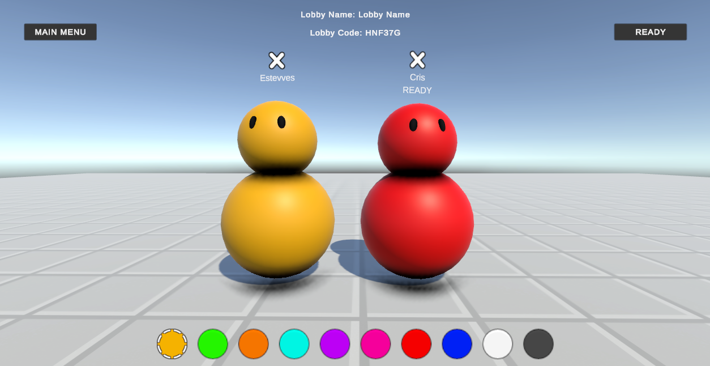

# KitchenChaos Multiplayer
#### Hello there! :wave: Attention :cop: :warning:

This readme has two versions, english and portuguese, if you want to read in portuguese click [HERE](#versão-em-português) or [PORTUGUÊS](#versão-em-português).

There's a lot of comments in the code, I know this is NOT a good clean code practice, however this project is used as a portfolio and as study material, for these reasons I think it is important to place several comments in the code, facilitating learning.

## Objective
This project has the objective to learn and practice game development, Unity, C#, clean code, in addition to use it as part of my portfolio.

## Introduction
This project has been made through the free course "[Learn Unity Multiplayer (FREE Complete Course, Netcode for Game Objects Unity Tutorial 2023)](https://youtu.be/7glCsF9fv3s?si=i2n0kB8eqpmUaguM)" by Hugo from [Codemonkey](https://www.youtube.com/@CodeMonkeyUnity) channel. In this course, codemonkey aims to teach you how to do a more complex project, with the main focus on clean code, using more advanced programming practices.

## Application
In the "Kitchen Chaos Multiplayer" project, the player controls a character inside a kitchen, the objective is to make the largest number of dishes ordered by customers within a time limit. The player can move the character and interact with the scenery, there are two interaction options, the first is to pick up/place an object, the second is to cut ingredients. Using these interactions, the player can pick up a dish, bread, fry a hamburger, cut a tomato, deliver the prepared dish to the customer, among other possibilities.

Game gif:

The game has support for mouse/keyboard and gamepad, some customizations for the user, options to change background music, sound effects, and an interaction menu for customizing keys.

Print menu options: 

In the multiplayer version of the game, players create a lobby and then go to character select scene, where it is possible to see all the players in the lobby and choose the color each one wants to use.

Print character select scene: 

## Assets
All the assets were distributed for free by [Codemonkey](https://www.youtube.com/@CodeMonkeyUnity) for the course.

## Conclusion
This project is a sequel from my last project, in the first "Kitchen Chaos" the player was alone, it was a completely single player game, in "Kitchen Chaos Multiplayer" the idea was to take a project that was already done and turn it into multiplayer.

I thought it would be easy to turn Kitchen Chaos into multiplayer, since the project was done, however I couldn't be more wrong. The entire transition from single player to multiplayer was much more difficult than I thought, building the entire relationship between server and client, what will be shown to the client, or what remains only on the server, all of this was quite a incredible learning experience and made me have a greater understanding of how a server works.

Thanks again to Hugo from [Codemonkey](https://www.youtube.com/@CodeMonkeyUnity) channel for making such high-level content available for free.

The finished game will be on my [Itch.io](https://estevves.itch.io/) page.

Thanks for reading, I wish you a good week, see ya. :wave:

---
## Versão em português

#### Observação :warning:
Tem diversos comentários no código desse projeto, tenho ciência de que essa NÃO é uma boa prática de clean code, entretanto esse projeto é utilizado como potfólio e como material de estudo, por esses motivos acho importante colocar diversos comentários no código, facilitando o aprendizado.

## Objetivo
Esse projeto tem o objetivo de praticar desenvolvimento de jogos, Unity3D, C#, práticas de clean code, além de usá-lo como parte do meu portfólio.

## Introdução
Esse projeto foi realizado no curso gratuito "[Learn Unity Multiplayer (FREE Complete Course, Netcode for Game Objects Unity Tutorial 2023)](https://youtu.be/7glCsF9fv3s?si=i2n0kB8eqpmUaguM)" pelo Hugo do canal [Codemonkey](https://www.youtube.com/@CodeMonkeyUnity). Nesse curso, o codemonkey tem o intuito de ensinar a fazer um projeto um pouco mais complexo, com foco principal em clean code, ou seja, utilizando práticas de programação mais avançadas.

## Aplicação
No projeto "Kitchen Chaos Multiplayer" o jogador controla um personagem dentro de uma cozinha, o objetivo é fazer a maior quantidade de pratos pedidos pelos clientes dentro de um limite de tempo. O jogador pode mover o personagem e interagir com o cenário, existem duas opções de interações, a primeira é de pegar e/ou colocar um objeto, a segunda é de cortar ingredientes. Utilizando essas interações, o jogador pode pegar um prato, pão, fritar um hamburger, cortar um tomate, entregar o prato feito para o cliente, entre outras possibilidades.

Gif do jogo:

O jogo possui suporte para mouse/teclado e gamepad, além de algumas customizações para o usuário, como opções de alterar música de fundo, efeitos sonoros, e um menu de interação para customização de teclas dentro do jogo, sejam elas para teclado ou gamepad.

Print menu options: 

Na versão multiplayer do jogo, os jogadores criam um lobby e em seguida vão para a escolha de personagens, onde é possível ver todos os jogadores da partida e escolher a cor que cada um deseja utilizar.

Print escolha de personagem: 

## Assets
Todos os assets foram distribuidos gratuitamente pelo Hugo do canal [Codemonkey](https://www.youtube.com/@CodeMonkeyUnity) para a realização do curso.

## Conclusão
Esse projeto foi uma continuação do projeto anterior, no primeiro "Kitchen Chaos" o jogador estava sozinho, era um jogo completamente single player, já no "Kitchen Chaos Multiplayer" a ideia era pegar um projeto que já estava pronto e transformá-lo em multiplayer.

Eu imaginei que seria "fácil" transformar o Kitchen Chaos em multiplayer, já que o projeto estava pronto, e eu não poderia estar mais errado. Toda a transição de single player para multiplayer foi bem mais dificil do que eu imaginava, construir toda a relação entre server e client, saber o que vai ser mostrado para o client, ou o que fica só no server, tudo isso foi um aprendizado bastante incrível e me fez ter uma noção maior de como funciona um servidor.

Agradeço novamente ao Hugo do canal [Codemonkey](https://www.youtube.com/@CodeMonkeyUnity) por disponibilizar um conteúdo de nível tão alto de forma gratuita.

O jogo finalizado estará na minha página do [Itch.io](https://estevves.itch.io/).

Obrigado por ler até aqui, te desejo uma ótima semana, até mais. :wave:
